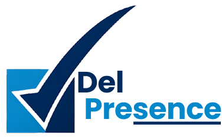

<div align="center">
  
  <h1>DelPresence</h1>
</div>

<div align="center">
  
  
  
</div>

<br />

<p align="center">
  <strong>An integrated cloud-based platform for digital and real-time attendance management at Del Institute of Technology (IT Del).</strong>
</p>

## Executive Summary

**DelPresence** is a digital attendance system (Final Project for Group 4 at IT Del) that combines a Mobile App (Flutter) and a Web App (Next.js). This platform utilizes **QR Code** and **Face Recognition** for attendance tracking, replacing manual paper-based processes that are time-consuming and prone to fraud.

## Key Features

- **Mobile App (Flutter)**: 
  - Fast attendance using QR Code & Face Recognition.
  - View class schedules & attendance history.
- **Web App (Next.js)**: 
  - **Admin Panel**: Centralized academic data management.
  - **Lecturer & Assistant Panel**: Open lecture sessions, generate QR Codes, mark attendance manually, and download reports in spreadsheet format.
- **System Integration**: Direct synchronization from IT Del's Campus API (auth, authorization, academic data).
- **Security & Scalability**: JWT Authentication with Role-Based Access Control, bcrypt, dockerized.

---

## Tech Stack & Core Systems

| Category | Technology |
| --- | --- |
| **Frontend Web** | Next.js 16 (App Router), Tailwind CSS, shadcn/ui, TypeScript |
| **Backend API** | Go 1.23, Gin Framework, PostgreSQL, GORM, JWT Auth |
| **Mobile App** | Flutter (Dart ≥3.0) + `flutter_face_api` + `qr_code_scanner` |
| **Infrastructure/Deployment**| Docker, Docker Compose, Nginx (Reverse Proxy), GCP |

---

## How to Run the Application

The DelPresence application in this repository is divided into 3 main component directories (Frontend Web at root, Backend API in `backend/`, and Mobile in `mobile-app/`).

### System Prerequisites
Ensure your operating system has the following installed:
- [Node.js](https://nodejs.org/) (version 20 or above)
- [Go](https://golang.org/) (version 1.23 or above)
- [Flutter SDK](https://flutter.dev/) (version 3.0+)
- [PostgreSQL](https://www.postgresql.org/) (version 15 or above)
- [Docker & Docker Compose](https://www.docker.com/) (Optional for quick setup)

---

### 1. Running Manually (Development Mode)

#### A. Running the Frontend Web (Next.js)
1. Open a terminal in the root folder of this project.
2. Copy the *environment variable* template:
   ```bash
   cp .env.example .env
   ```
3. Install dependencies:
   ```bash
   npm install
   ```
4. Start the *development server* with Turbopack:
   ```bash
   npm run dev
   ```
5. Access the Frontend Panel in your browser: `http://localhost:3000`

#### B. Running the Backend API (Go)
1. Open a new terminal and navigate to the *backend* folder:
   ```bash
   cd backend
   ```
2. Copy the *environment variable* template for database connection & API credentials:
   ```bash
   cp .env.example .env
   ```
   *(Ensure the PostgreSQL application is running and the credentials are correct in this `.env` file)*
3. Download package dependencies:
   ```bash
   go mod download
   ```
4. Start the backend server:
   ```bash
   go run cmd/server/main.go
   ```

#### C. Running the Mobile App (Flutter)
1. Open a new terminal and navigate to the mobile directory:
   ```bash
   cd mobile-app
   ```
2. Get Dart dependencies:
   ```bash
   flutter pub get
   ```
3. Run the application on an emulator or a connected device:
   ```bash
   flutter run
   ```

---

### 2. Running with Docker (Easiest)

The Next.js web project and proxy gateway are also equipped with a `Dockerfile` and `docker-compose.yml` for *production* phase and simplifying application orchestration.

1. Open a terminal in the root folder of the project.
2. Set up the `.env` file credentials (if you haven't already).
3. Run the Docker Compose command below to *build & run* in the background (detached mode):
   ```bash
   docker-compose up -d --build
   ```
4. The Frontend and Nginx Reverse Proxy containers will be initialized.
   - You can access the application on port `80` via browser (`http://localhost`).
5. Additional Docker commands:
   - View container logs: `docker-compose logs -f`
   - Stop and remove docker environment: `docker-compose down`

*(Note: For the Go backend, you can use a similar configuration file located at `./backend/docker-compose.yml` if available).*

---

## Development Team (Final Project Group 4)

This platform was developed by the Del Institute of Technology Development Team:
- **Jody Edriano Pangaribuan** - Project Manager / Fullstack Developer
- **Marshanda Kasih Simangunsong** - Member
- **Anno Deritman Siregar** - Member
- **Jessica Anastasya Purba** - Member
- **Prapanca Ronaldo Panjaitan** - Member
- **Kezia M S Siahaan** - Member

<br />

> **License**: © 2026 Del Institute of Technology | Developed by Group 4, Final Project 2. All rights reserved.
